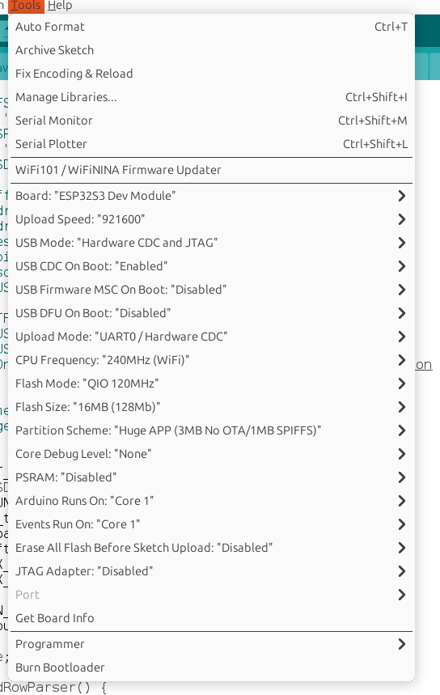

# PassMan

## Basic functionlities
1. Button pressed 1 time - Switch between passwords / Navigating between menu items
2. Button double-pressed - Insert password currnently visible on screen / Confirm menu item action
3. Button triple-pressed - Insert login currently visible on the screen
4. Button pressed 4 times swiftly - insert previous password
5. Button long press - toggle menu

### Menu functionlity
1. Enable bluetooth - turn on bluetooth to be able to manage passwords using webpage
2. Re-generate password - create new password for currently selected item (old pssword is stored and available using 4-times button press)
3. Dump all - stick will print all passwords and partially hidden servicenames and logins stored on the card (can be used to created printed backups) 

## Burning usb stick
1. Get a T-dongle S3 (ESP32S3) stick (more details at [https://github.com/Xinyuan-LilyGO/T-Dongle-S3/blob/main/docs/en/t-dongle-s3/REAMDE.MD])
2. Open firmware/firmware.ino in Arduino IDE 
3. Install dependencies
    a. TFT_eSPI at version 2.4.78
    b. OneButton at version 2.0.2 https://github.com/mathertel/OneButton
    c. FastLED at version 3.5.0 https://github.com/FastLED/FastLED
3. Adjust Arduino IDE as per image below 
4. Insert stick while holding the button pressed
5. Upload firmware.ino to the stick
6. Unplug the stick and plug it again (without holding button) again to start using device normally

## Managing passwords
1. Connect a stick with uploaded firmare to any usb socket
2. Long press button to show menu
3. Navigate to `Enable bluetooth` item and double-press button to enable it
4. Open [https://ant777.github.io/passman/] and click on Connect button
5. Provide permission for the page to use Bluetooth if requested
6. Select PassMan device from the bluetooth devic list and confirm by clicking on Pair button
7. On the stick's screen a bluetooth connection confirmation message should appear, confirm by navigating to Yes option and double-press stick's button
8. Once stick is connected to the page - it is possible to create new items or update and remove the item that is visible on the stick's screen